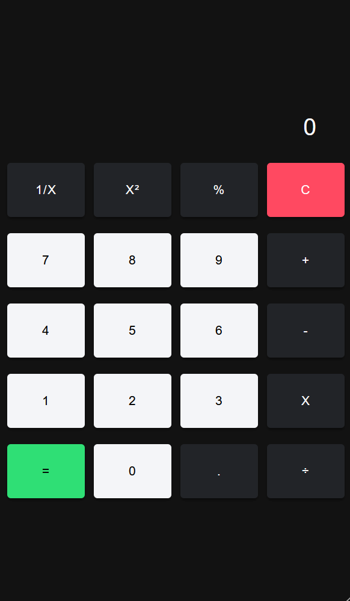

## Ionic Calculator App



## Overview

This is a basic calculator app built with Ionic, a cross-platform mobile app development framework. The app allows users to perform basic arithmetic calculations on their mobile devices.

## Prerequisites

Before you begin, ensure you have met the following requirements:

Node.js: Make sure Node.js is installed on your machine. You can download it from https://nodejs.org/.

Ionic CLI: Install the Ionic CLI globally by running the following command:

```bash
npm install -g @ionic/cli
```

## Getting Started

To get the app up and running, follow these steps:

1. Clone the repository:

```bash
git clone https://github.com/yourusername/ionic-calculator-app.git
```

2. Navigate to the project directory:

```bash
cd ionic-calculator-app
```

3. Install dependencies:

```bash
npm install
```

4. Run the app in your browser:

```bash
ionic serve
```
